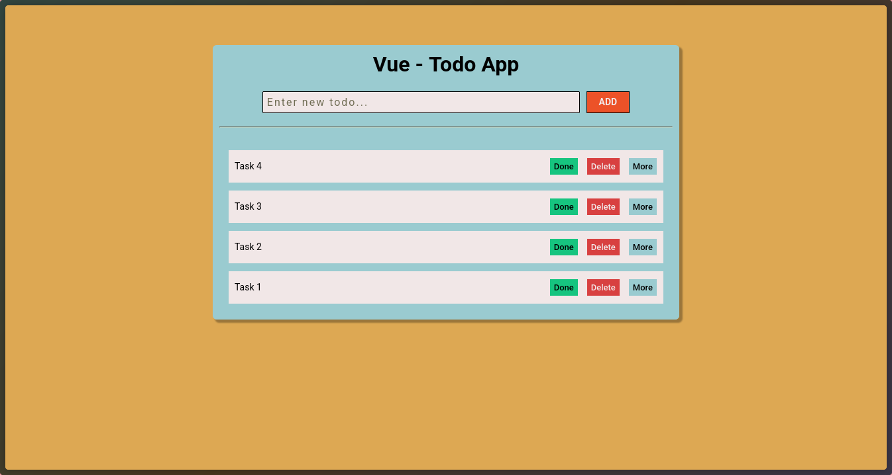
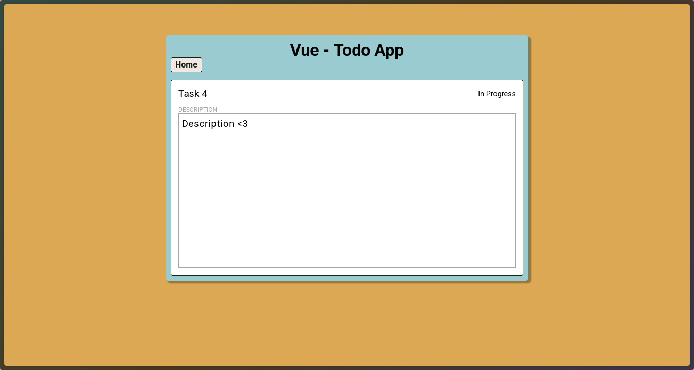

# vue-todo-app




## Project Setup

```sh
bun install
```

### Compile and Hot-Reload for Development

```sh
bun dev
```

### Type-Check, Compile and Minify for Production

```sh
bun run build
```

### Lint with [ESLint](https://eslint.org/)

```sh
bun lint
```

## Project summary
